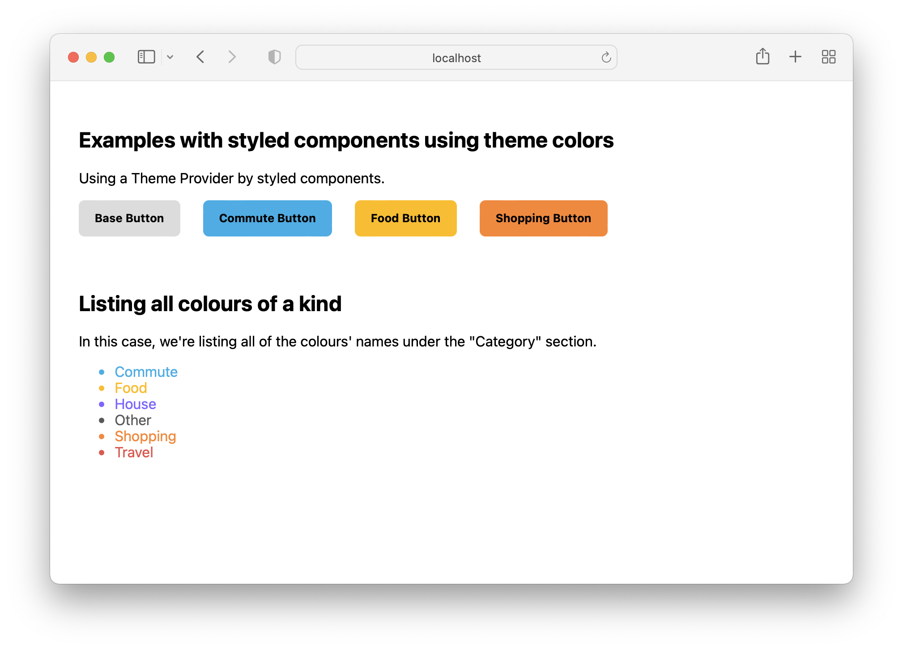

# Using Sketch color tokens export

Going from this:


To this:



## Instalation instructions

You'll need [`yarn`](https://classic.yarnpkg.com/lang/en/docs/install/) or [`npm`](https://docs.npmjs.com/downloading-and-installing-node-js-and-npm) to run this project, along with renaming the `SAMPLE_tokensURL.json` file in the project to `tokens.json` and adding your tokens URL there.

Before starting the project, you'll need to install the dependencies with either of these commands:

- `yarn`
- `npm i`

To start the project in development mode, you can:

- `yarn start`
- `npm run start`

And to build for production mode:

- `yarn build`
- `npm run build`

This project features React with Webpack and Styled Components, using Javascript.
 
## Importing your tokens into a file

Here's a quick example on how you can use the new Export Color Tokens feature on Sketch with your project.

After activating your public Color Token URL, you can drop it on a `tokensURL.json` file at the root of your project, in the following format:

```
{"url": "<YOUR_URL_HERE>"}
```

The `start` and `build` scripts mentioned above will generate a `theme/colors.json` file with your colour tokens. The code doing this is the following, found on the file [getColors.js](getColors.js):

```
const fs = require('fs');
const https = require('https');
const tokensUrl = require('./tokensUrl.json');

const file = fs.createWriteStream('./src/theme/colors.json');

https.get(tokensUrl.url, (response) => {
 const stream = response.pipe(file);

 stream.on('finish', function () {
  console.log('colors imported');
 });
});

```

## Using the tokens in your project

We're providing an example React + Styled Components app that uses tokens from the exported file. To do this on your project, you simply import your tokens file where you need it.

In our case, we have two colour groups on our tokens file: `Buttons` and `ColorList`. These two are explored on the [ColorList.jsx](/src/components/ColorList.jsx) and [Buttons.jsx](/src/components/Buttons.jsx) files, providing you different examples on how to access the token values.

On the [`Buttons`](/src/components/Buttons.jsx), we're providing the colour file to the `ThemeProvider` of `styled-components`, so we can directly use the tokens on the components:

```
const GreenButton = styled(BaseButton)`
 background: ${({ theme }) => theme.Fill['Offset'].value};
`;
```

On [`ColorList`](/src/components/ColorList.jsx), we're listing all the colours, without providing a theme:

```
<CategoryColorItem
    key={index}
    colorValue={theme.Category[colorName].value}
    >
    {colorName}
</CategoryColorItem>
```
